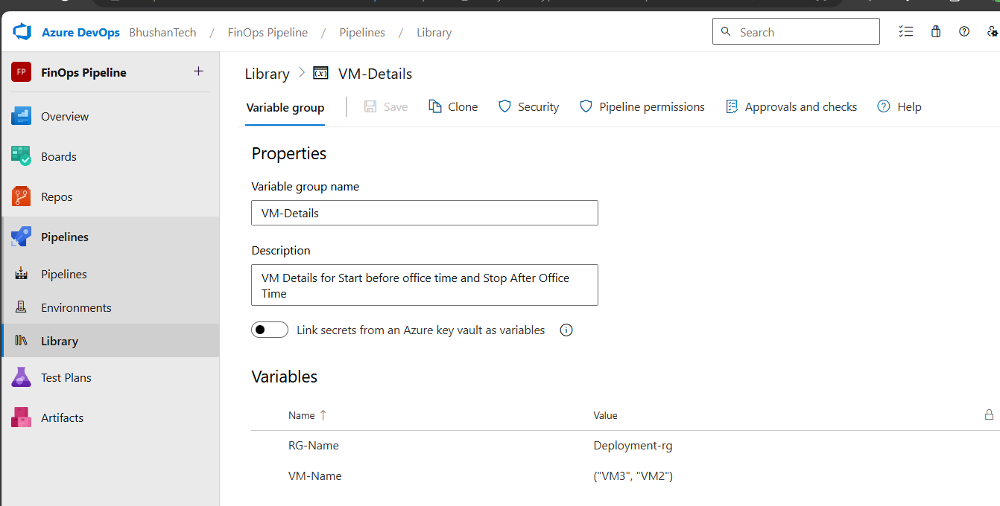

# Azure DevOps Pipeline for VM Management

This repository contains Azure DevOps pipeline configurations for managing Azure Virtual Machines (VMs) using Azure CLI. The pipelines are designed to start and stop VMs on a schedule and utilize variable groups to manage VM details dynamically.

## Prerequisites

Before you start, ensure you have the following:

1. **Azure Subscription**
2. **Azure DevOps Account**
3. **Service Connection** in Azure DevOps with sufficient permissions
4. **Variable Group** in Azure DevOps containing VM details

## Variable Group Configuration

1. Go to **Pipelines > Library > + Variable group**.
2. Create a variable group named `VM-Details` with the following variables:
   - `RG-Name`: Name of the Resource Group (e.g., `Deployment-rg`)
   - `VM-Name`: JSON array of VM names (e.g., `["VM1", "VM2"]`)

## Setting Up the Pipeline

1. **Clone the Repository**: Clone this repository to your local machine.
2. **Create Variable Group**: Ensure you have a variable group named `VM-Details` in Azure DevOps with the necessary variables (`RG-Name` and `VM-Name`).
3. **Set Up Service Connection**: Ensure you have a service connection in Azure DevOps named `Finops Service Connection` with appropriate permissions.
4. **Update Pipeline YAML**: Adjust the schedule and variables as needed in the pipeline YAML files.
5. **Run the Pipeline**: Trigger the pipeline manually or let it run on the defined schedule.

## Refer to the Code

For detailed pipeline configurations and scripts, refer to the code in this repository.

### Common VM Management Commands

Here are some common Azure CLI commands for VM management, which are used in the pipeline scripts:

- Start a VM: `az vm start --resource-group myResourceGroup --name myVM`
- Stop a VM: `az vm stop --resource-group myResourceGroup --name myVM`
- Deallocate a VM: `az vm deallocate --resource-group myResourceGroup --name myVM`
- Restart a VM: `az vm restart --resource-group myResourceGroup --name myVM`
- Redeploy a VM: `az vm redeploy --resource-group myResourceGroup --name myVM`
- Delete a VM: `az vm delete --resource-group myResourceGroup --name myVM`

## Advanced Features

Explore the advanced features by modifying the pipeline YAML files and adding more Azure CLI commands for various VM management tasks.

### Contributing

Feel free to open issues or submit pull requests with improvements or additional features.

## License

This project is licensed under the MIT License - see the LICENSE file for details.
